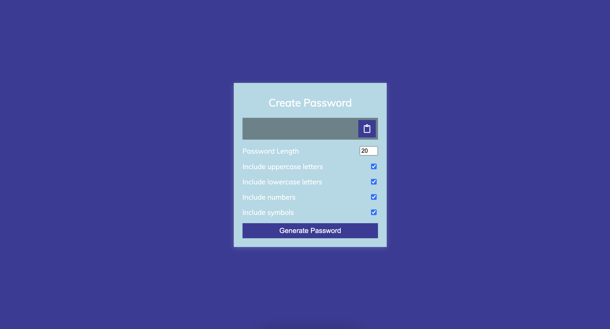

# JavaScript Bootcamp Project : Password-Generator 👋

**By Saurabh**

## [GO LIVE]()

## 

---

## Technologies used

> JavaScript

> HTML

> CSS
---
## **Skill Gained in the project**

- Learn about Dom-manipulation. 
- Learn about neasted if condition.
- Learn about event listners.

## **Time taken to finish this**

- it's Approximately **9 Hour** to understand the concept

---